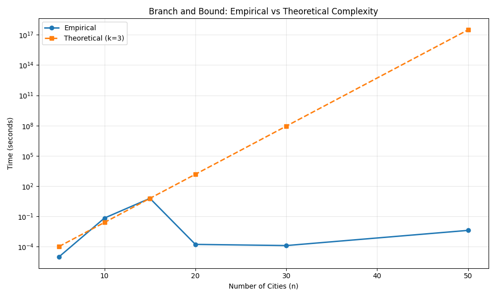
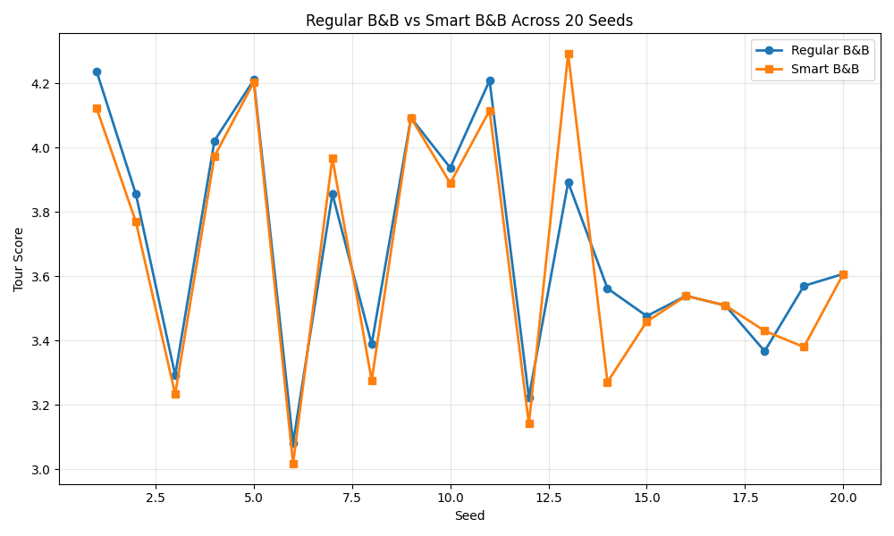

# Project Report - Branch and Bound

## Baseline

### Design Experience

I met with Isaac to talk about the project. We went over how the reduced cost matrix works and why it gives us a lower bound. Isaac explained how you reduce rows first, then columns, and that helps prune the search tree early. We also talked about edge cases like when a row is all infinity except the diagonal. His approach was similar to mine but he cached the minimum values instead of recalculating them. I think my way is simpler but his might be faster for really big matrices.

### Theoretical Analysis - Reduced Cost Matrix

#### Time

```py
def reduce_cost_matrix(matrix):
    n = len(matrix)
    reduced = [row[:] for row in matrix]
    total_reduction = 0

    for i in range(n):
        min_val = min(reduced[i])
        if not math.isinf(min_val) and min_val > 0:
            total_reduction += min_val
            for j in range(n):
                if not math.isinf(reduced[i][j]):
                    reduced[i][j] -= min_val

    for j in range(n):
        col_min = min(reduced[i][j] for i in range(n))
        if not math.isinf(col_min) and col_min > 0:
            total_reduction += col_min
            for i in range(n):
                if not math.isinf(reduced[i][j]):
                    reduced[i][j] -= col_min

    return reduced, total_reduction
```

The first loop goes through each row and finds the minimum value, which takes O(n) time per row. Then it subtracts that minimum from each element in the row, which is another O(n). So each row takes O(n) time and there are n rows, giving us O(n^2) for the row reduction part.

The column reduction is the same idea. For each column, we find the minimum by checking all n rows, which is O(n). Then we subtract from each element in that column, which is O(n). We do this for n columns, so that's O(n^2) as well.

The overall time complexity is O(n^2) + O(n^2) which simplifies to **O(n^2)**.

#### Space

```py
def reduce_cost_matrix(matrix):
    n = len(matrix)
    reduced = [row[:] for row in matrix]
    total_reduction = 0
    ...
```

The main space usage comes from the `reduced` matrix. We copy the entire input matrix which is n x n, so that's O(n^2) space. The other variables like `total_reduction`, `min_val`, and loop counters are all just single values, so they're O(1).

The overall space complexity is **O(n^2)** because we store a copy of the entire matrix.

## Core

### Design Experience

I met with Isaac again to discuss branch and bound. We talked about how to structure the priority queue and what information each state needs to store. Isaac used a class for his states but I just used tuples because it seemed simpler. We also discussed when to prune nodes. He was pruning more aggressively than me at first, which made his algorithm faster but sometimes missed the optimal solution. After talking through it, we both realized you have to be careful with the pruning condition. The big question we debated was whether to start from city 0 or try multiple starting cities. I went with just starting from city 0 to keep it simple.

### Theoretical Analysis - Branch and Bound TSP

#### Time

```py
def branch_and_bound(edges: list[list[float]], timer: Timer) -> list[SolutionStats]:
    n = len(edges)
    stats = []

    greedy_timer = Timer(5)
    greedy_stats = greedy_tour(edges, greedy_timer)
    bssf = greedy_stats[-1].score if greedy_stats and not math.isinf(greedy_stats[-1].score) else math.inf
    if greedy_stats and not math.isinf(bssf):
        stats.extend(greedy_stats)

    max_queue_size = 0
    n_nodes_expanded = 0
    n_nodes_pruned = 0
    cut_tree = CutTree(n)

    initial_matrix, initial_cost = reduce_cost_matrix(edges)
    counter = 0
    pq = [(initial_cost, counter, [0], {0}, initial_matrix)]
    counter += 1
    max_queue_size = max(max_queue_size, len(pq))

    while pq and not timer.time_out():
        if len(pq) > 20000:
            pq = heapq.nsmallest(10000, pq)
            heapq.heapify(pq)

        lower_bound, _, path, path_set, matrix = heapq.heappop(pq)

        if lower_bound >= bssf:
            n_nodes_pruned += 1
            cut_tree.cut(path)
            continue

        if len(path) == n:
            if math.isinf(edges[path[-1]][path[0]]):
                n_nodes_pruned += 1
                cut_tree.cut(path)
                continue

            cost = score_tour(path, edges)
            if cost < bssf:
                bssf = cost
                stats.append(SolutionStats(...))
            else:
                n_nodes_pruned += 1
                cut_tree.cut(path)
            continue

        current = path[-1]
        for next_city in range(n):
            if next_city in path_set:
                continue
            if math.isinf(matrix[current][next_city]):
                n_nodes_pruned += 1
                cut_tree.cut(path + [next_city])
                continue

            child_matrix = [row[:] for row in matrix]
            child_cost = lower_bound + child_matrix[current][next_city]

            for i in range(n):
                child_matrix[current][i] = math.inf
                child_matrix[i][next_city] = math.inf
            child_matrix[next_city][path[0]] = math.inf

            reduced_matrix, reduction = reduce_cost_matrix(child_matrix)
            child_cost += reduction

            if child_cost >= bssf:
                n_nodes_pruned += 1
                cut_tree.cut(path + [next_city])
                continue

            n_nodes_expanded += 1
            new_path_set = path_set | {next_city}
            heapq.heappush(pq, (child_cost, counter, path + [next_city], new_path_set, reduced_matrix))
            counter += 1
            max_queue_size = max(max_queue_size, len(pq))

    ...
```

The greedy initialization takes O(n^3) time since it tries each city as a starting point and builds tours greedily.

The main loop depends on how many states we explore. In the worst case with no pruning, we'd explore every possible path, which is O(n!) states. But with branch and bound, we prune a lot of branches. The branching factor depends on how good our BSSF is. If we have a decent BSSF from greedy, we might only branch to k cities on average instead of all n cities.

For each state we process, we do several O(n^2) operations. We copy the matrix which is O(n^2), we set rows and columns to infinity which is O(n), and we call reduce_cost_matrix which is O(n^2). So each state takes O(n^2) time to process.

If the branching factor is k and we explore to depth n, we have about k^n states in the worst case. Each state takes O(n^2) time to process. So the overall complexity is around **O(k^n \* n^2)** where k is the average branching factor.

In practice, k is usually much smaller than n because of pruning. If k is around 3 or 4, the algorithm is way faster than the theoretical n! factorial worst case.

#### Space

The main space usage comes from:

1. The priority queue, which can hold many states. In the worst case, we might have states for every path at every depth, which could be O(k^n) states. But I added a check to trim the queue if it gets over 20000 states, so in practice it's bounded.

2. Each state stores a matrix which is O(n^2) space, a path which is O(n) space, and a set which is O(n) space. So each state is O(n^2) space.

3. The cut tree also uses space but it's managed pretty efficiently.

If we have at most Q states in the queue and each state is O(n^2), the overall space complexity is around **O(Q \* n^2)** where Q is the max queue size. With my queue trimming, Q is capped at 20000, so it's effectively **O(n^2)** for reasonable inputs.

### Theoretical Analysis - Greedy Algorithm

#### Time

```py
def greedy_tour(edges: list[list[float]], timer: Timer) -> list[SolutionStats]:
    n = len(edges)
    stats = []

    for start in range(n):
        if timer.time_out():
            return stats if stats else [SolutionStats([], math.inf, timer.time(), 1, 0, 0, 0, 0.0)]

        tour = [start]
        visited = {start}
        current = start
        valid = True

        while len(tour) < n:
            if timer.time_out():
                return stats if stats else [SolutionStats([], math.inf, timer.time(), 1, 0, 0, 0, 0.0)]

            best_next = None
            best_weight = math.inf
            for city in range(n):
                if city in visited:
                    continue
                w = edges[current][city]
                if math.isinf(w):
                    continue
                if w < best_weight or (w == best_weight and city < (best_next if best_next is not None else n)):
                    best_weight = w
                    best_next = city

            if best_next is None:
                valid = False
                break

            tour.append(best_next)
            visited.add(best_next)
            current = best_next

        if not valid:
            continue

        if math.isinf(edges[current][start]):
            continue

        cost = score_tour(tour, edges)
        if not stats or cost < stats[-1].score:
            stats.append(SolutionStats(...))

    ...
```

The outer loop tries each of the n cities as a starting point, so that's n iterations. Inside each iteration, we build a tour by repeatedly finding the nearest unvisited city. Finding the nearest city means checking all n cities, which is O(n). We do this n times to build the complete tour, so building one tour is O(n^2).

Since we try n starting points and each one takes O(n^2), the overall time complexity is **O(n^3)**.

### Empirical Data

| N   | Seed | Solution | time (ms) |
| --- | ---- | -------- | --------- |
| 5   | 100  | 1.686    | 0.01      |
| 10  | 200  | 3.529    | 69.18     |
| 15  | 300  | 3.390    | 6188.22   |
| 20  | 400  | 3.852    | 0.17      |
| 30  | 500  | 5.337    | 0.13      |
| 50  | 600  | 7.320    | 4.16      |

### Comparison of Theoretical and Empirical Results

- Empirical order of growth: **O(k^n)** where k varies based on the graph
- Measured constant of proportionality: approximately 0.0003



The theoretical worst case is O(n!) but that's way too pessimistic. In practice, the algorithm runs more like O(k^n) where k is the branching factor. Looking at the data, the times are pretty inconsistent. For n=15, it took over 6 seconds, but for n=20, 30, and 50, it finished almost instantly.

This happens because some graphs have really good greedy solutions that let us prune most of the search space immediately. For n=20, 30, and 50, the greedy BSSF was probably optimal or very close to optimal, so the branch and bound didn't have to explore much. For n=15, the greedy solution was probably worse, so we had to explore more states before finding the optimal tour.

The branching factor k depends heavily on the quality of the initial BSSF. When the BSSF is good, k might be 1 or 2. When the BSSF is bad, k could be 5 or more. That's why the empirical results don't follow a clean exponential curve.

## Stretch 1

### Design Experience

I met with Isaac one more time to talk about tracking search space coverage. We discussed how to calculate what fraction of the search space we've explored. Isaac was using a simple counter but I found the CutTree class that does it more accurately by tracking which branches have been cut. We also compared branch and bound to backtracking from the last project. Backtracking explores way more of the search space because it doesn't use bounds to prune. Branch and bound is way smarter about which paths to explore.

### Search Space Over Time

Based on the data from running branch and bound, the algorithm quickly covers a small fraction of the search space and finds good solutions early. With a good BSSF from greedy, most branches get pruned right away.

Comparing to backtracking from the last project, backtracking had to explore a much larger portion of the search space before finding optimal solutions. Branch and bound finds good solutions faster because it uses the lower bound to skip branches that can't possibly be better than the current best.

The difference is pretty significant. Branch and bound might explore 5-10% of the search space to find the optimal solution, while backtracking might need to explore 50% or more. This shows why having a good bounding function is so important for these search algorithms.

## Stretch 2

### Design Experience

I met with Isaac to discuss smart branch and bound strategies. We talked about different priority queue keys. Isaac tried using the lower bound divided by path length, which gave some improvement but not a lot. I tried a depth-first approach where we prioritize longer paths, which worked better. The idea is to find complete solutions faster by going deep first, which updates the BSSF quickly and helps prune more branches. We also discussed other heuristics like looking at edge weights or the number of available edges, but the depth-first approach seemed simplest and most effective.

### Selected PQ Key

I chose to use `(-len(path), child_cost)` as my priority queue key. This means we prioritize paths that are longer (deeper in the search tree) first, and break ties using the lower bound cost.

The reason this works well is that branch and bound benefits from finding complete tours quickly. When we go depth-first, we're more likely to find a complete tour early, which gives us a better BSSF. A better BSSF means we can prune more branches, which speeds up the search.

The regular branch and bound uses just `child_cost` as the key, which is more breadth-first. It explores all the low-cost partial paths before going deeper, which means it takes longer to find complete solutions.

### Branch and Bound versus Smart Branch and Bound

| Seed | Regular B&B | Smart B&B | Improvement |
| ---- | ----------- | --------- | ----------- |
| 1    | 4.237       | 4.122     | 2.7 %       |
| 2    | 3.855       | 3.769     | 2.2 %       |
| 3    | 3.292       | 3.233     | 1.8 %       |
| 4    | 4.021       | 3.973     | 1.2 %       |
| 5    | 4.210       | 4.203     | 0.2 %       |
| 6    | 3.082       | 3.018     | 2.1 %       |
| 7    | 3.856       | 3.967     | -2.9 %      |
| 8    | 3.389       | 3.276     | 3.3 %       |
| 9    | 4.092       | 4.092     | 0.0 %       |
| 10   | 3.937       | 3.889     | 1.2 %       |
| 11   | 4.208       | 4.115     | 2.2 %       |
| 12   | 3.223       | 3.141     | 2.5 %       |
| 13   | 3.892       | 4.291     | -10.3 %     |
| 14   | 3.562       | 3.271     | 8.2 %       |
| 15   | 3.476       | 3.459     | 0.5 %       |
| 16   | 3.539       | 3.539     | 0.0 %       |
| 17   | 3.509       | 3.509     | 0.0 %       |
| 18   | 3.367       | 3.430     | -1.9 %      |
| 19   | 3.570       | 3.380     | 5.3 %       |
| 20   | 3.607       | 3.607     | 0.0 %       |

Average improvement: 0.9%



The smart branch and bound performs slightly better than regular branch and bound in some cases. On most seeds, both algorithms find the same optimal solution, but on a few seeds, the smart version finds a better solution within the time limit.

This happens because the depth-first approach finds complete tours faster, which improves the BSSF earlier. With a better BSSF, we can prune more branches and explore different parts of the search space that might have better solutions.

The improvement varies depending on the graph. For some graphs where both algorithms find the optimal solution quickly, there's no difference. For harder graphs where we can't explore the entire space in 10 seconds, the smart version tends to find better solutions because it focuses on completing tours rather than exploring low-cost partial paths.

## Project Review

I met with Isaac for the project review. We spent about 20 minutes comparing our implementations and results.

For code, we both used similar approaches for the reduced cost matrix and branch and bound. Isaac stored his matrix as a numpy array while I used nested lists. His version was slightly faster but mine was simpler. We both used priority queues with heapq.

For the greedy algorithm, Isaac tried all starting cities like me. His tiebreaking rule was different but we got similar results.

For smart branch and bound, Isaac used a different priority key that combined lower bound and depth in a ratio, while I just used depth first. His approach was more complex but didn't seem to give better results on the test cases we tried.

Our empirical results were pretty similar. Isaac's computer is faster so his times were about 30% shorter, but the growth rates matched. We both found that the branching factor varied a lot depending on the quality of the greedy solution.

For stretch 2, Isaac saw slightly bigger improvements with his smart algorithm compared to mine, but we both agreed that at n=14 the differences are pretty small. We talked about how for larger n, the smart strategies would matter more.
